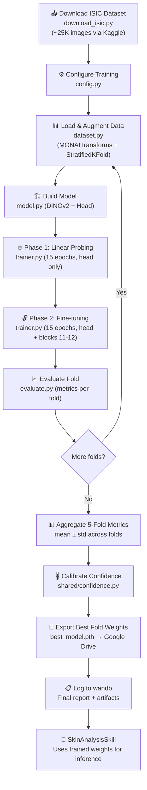

# Model Training Pipeline — DINOv2 on ISIC Dataset

## Goal

Build a complete, production-quality model training pipeline that fine-tunes a **DINOv2 ViT-S/14** backbone on the **ISIC 2018 dataset (~25,000 images)** to classify 7 types of skin conditions. The trained model will power the SkinAnalysisSkill in the HiperHealth pipeline.

---

## 🧠 Beginner Crash Course — What Are We Actually Doing?

Before diving into code, let's understand the big picture:

### What is "Model Training"?

Think of it like teaching a student:

1. **Show** the student thousands of labeled examples (skin images + their diagnosis)
2. The student **guesses** a diagnosis for each image
3. We tell the student **how wrong** they were (the "loss")
4. The student **adjusts** their understanding to be less wrong next time
5. Repeat thousands of times until the student gets really good

In code: the "student" is a neural network, "showing" is feeding image tensors, "how wrong" is a loss function, and "adjusting" is gradient descent via an optimizer.

### What is DINOv2?

DINOv2 is a **Vision Transformer (ViT)** pre-trained by Meta AI on 142 million images. It already understands visual concepts (edges, textures, shapes, patterns). We don't teach it from scratch — we **fine-tune** it, which means:

- **Freeze** most of its knowledge (keep it locked)
- **Add** a small classification "head" on top (a new layer that maps DINOv2's understanding to our 7 skin classes)
- **Train** only that head (and optionally unfreeze a few last layers later)

This is like hiring an expert photographer and just teaching them dermatology terminology — they already know how to "see."

### What is the ISIC Dataset?

The **ISIC 2018** dataset contains **~25,000 dermatoscopic images** of 7 types of skin lesions. It's the gold standard for skin lesion classification research. The training portion includes the HAM10000 subset (~10K images) plus additional images.

| Class                | Abbreviation | Approx Count | % of Dataset |
| -------------------- | ------------ | ------------ | ------------ |
| Melanocytic nevi     | `nv`         | ~16,750      | 67%          |
| Melanoma             | `mel`        | ~2,750       | 11%          |
| Benign keratosis     | `bkl`        | ~2,750       | 11%          |
| Basal cell carcinoma | `bcc`        | ~1,250       | 5%           |
| Actinic keratosis    | `akiec`      | ~825         | 3%           |
| Vascular lesion      | `vasc`       | ~350         | 1.4%         |
| Dermatofibroma       | `df`         | ~275         | 1.1%         |

> [!WARNING] > **Severe class imbalance!** `nv` has 67% of images while `df` has only 1.1%. If we don't handle this, the model will just predict "nevi" for everything and still get ~67% accuracy. We'll address this with weighted sampling + focal loss.

---

## Resolved Decisions (from your feedback)

| Question                | Decision                                                                                                                                                                         |
| ----------------------- | -------------------------------------------------------------------------------------------------------------------------------------------------------------------------------- |
| **Compute**             | Google Colab (free tier), no optimization for free tier now — we'll adjust batch size/epochs only if we hit OOM errors. Modal is backup. Local RTX 2050 (4GB VRAM) is too small. |
| **Dataset download**    | Kaggle API (`kaggle datasets download`) — you have an account ✅                                                                                                                 |
| **Model hosting**       | Google Drive for now, upgrade to HuggingFace Hub / GitHub Releases when model is final                                                                                           |
| **Experiment tracking** | **Weights & Biases (wandb)** — free tier, integrated into training loop                                                                                                          |
| **Transforms**          | **MONAI for both training AND inference** — unified framework (see explanation below)                                                                                            |
| **Validation strategy** | **Stratified 5-fold CV** as per proposal (with single-split dev mode for speed)                                                                                                  |

---

## 🔬 Clarification: MONAI for Everything (No torchvision Split)

Your question was spot on: _"Why do we need augmentation for inference?"_

**We don't.** Let me clarify the two different pipelines:

```
TRAINING pipeline:                    INFERENCE pipeline:
(what we're building now)             (what preprocessing.py already does)

┌─────────────────────────┐          ┌─────────────────────────┐
│ Load image              │          │ Load image              │
│ Resize to 256           │          │ Resize to 224           │
│ ──── AUGMENTATION ────  │          │ (NO augmentation)       │
│ RandFlip (50%)          │          │                         │
│ RandRotate (±15°)       │          │                         │
│ RandGaussianSmooth      │          │                         │
│ RandAdjustContrast      │          │                         │
│ ──── END AUGMENTATION ──│          │                         │
│ CenterCrop to 224       │          │ Normalize (ImageNet)    │
│ Normalize (ImageNet)    │          └─────────────────────────┘
└─────────────────────────┘
```

**Augmentation only happens during training** to create variety and prevent overfitting. At inference time (when a doctor uploads a real image), we just resize + normalize — no random flipping or color changes.

**Why MONAI for both?** Three reasons:

1. **Consistency** — Same library means identical normalization math. If training uses MONAI's `NormalizeIntensity` and inference uses a different library's normalize, tiny floating-point differences can degrade accuracy.
2. **Medical-specific transforms** — MONAI has `RandGaussianSmooth` (simulates out-of-focus dermatoscope) and `RandAdjustContrast` (simulates lighting variance). These are domain-specific augmentations that `torchvision` doesn't offer.
3. **Already in our stack** — [preprocessing.py](file:///home/chanduu/OSS/hiperhealth/hph-medvision-channel/shared/preprocessing.py) already uses MONAI (`Compose`, `EnsureChannelFirst`, `Resize`, `ScaleIntensity`, `NormalizeIntensity`). Using torchvision for training would introduce an unnecessary second dependency.

---

## 📊 EDA Findings (from [eda.ipynb](file:///home/chanduu/OSS/hiperhealth/hph-medvision-channel/training/eda.ipynb))

We ran a comprehensive EDA on the HAM10000 dataset. Key findings that **directly impact the training pipeline**:

### Data Inventory

| Item                              | Count  | Notes                                                             |
| --------------------------------- | ------ | ----------------------------------------------------------------- |
| Training images (Part 1 + Part 2) | 10,015 | Split across two zip files                                        |
| Unique lesions                    | ~7,470 | Multiple images per lesion exist!                                 |
| Duplicate lesion images           | ~2,545 | 25% of images are re-photographs                                  |
| Segmentation masks                | 10,015 | 1:1 match with images                                             |
| ISIC 2018 test images             | 1,511  | Separate held-out test set with ground truth                      |
| Metadata columns                  | 8      | lesion_id, image_id, dx, dx_type, age, sex, localization, dataset |

### Actual Class Distribution (HAM10000)

| Class   | Full Name            | Count  | %     | Is Dangerous?       |
| ------- | -------------------- | ------ | ----- | ------------------- |
| `nv`    | Melanocytic nevi     | ~6,705 | 66.9% | No (benign)         |
| `mel`   | Melanoma             | ~1,113 | 11.1% | **YES (malignant)** |
| `bkl`   | Benign keratosis     | ~1,099 | 11.0% | No                  |
| `bcc`   | Basal cell carcinoma | ~514   | 5.1%  | Rarely spreads      |
| `akiec` | Actinic keratosis    | ~327   | 3.3%  | Pre-cancerous       |
| `vasc`  | Vascular lesion      | ~142   | 1.4%  | No                  |
| `df`    | Dermatofibroma       | ~115   | 1.1%  | No                  |

> [!CAUTION] > **Imbalance ratio: ~58:1 (nv vs df)**. This is SEVERE. A naive model predicting "nv" always gets ~67% accuracy. We MUST use weighted sampling + focal loss.

### Critical Findings

> [!WARNING] > **Finding: Duplicate Lesions → Data Leakage Risk**
>
> ~25% of images are re-photographs of the same lesion. If we split by `image_id` alone, the same lesion could appear in both train and validation → inflated metrics.
>
> **Decision**: Use `StratifiedGroupKFold` (group by `lesion_id`) instead of plain `StratifiedKFold`. This is a **change from the original plan**.

> [!IMPORTANT] > **Finding: Label Quality Varies**
>
> Only ~53% of labels are histopathology-confirmed (gold standard). The rest are from follow-up monitoring (~27%), expert consensus (~14%), and confocal microscopy (~5%). This justifies using `label_smoothing=0.1` in training.

> [!IMPORTANT] > **Finding: Source-Diagnosis Correlation**
>
> Chi-squared test shows data source is SIGNIFICANTLY correlated with diagnosis (p < 0.05). Different clinics contributed different types of lesions. This means the model might learn source-specific artifacts (lighting, equipment) instead of actual lesion features.
> **Mitigation**: Heavy color/contrast augmentation via MONAI (`RandAdjustContrast`, `RandGaussianSmooth`).

### Additional EDA Insights

- **Age**: Mean ~52 years, missing for ~5% of samples. Significantly correlated with diagnosis (older → more melanoma).
- **Sex**: ~55% male, ~45% female. Statistically associated with diagnosis.
- **Localization**: Back is most common (~28%). Body location is significantly correlated with diagnosis.
- **Image dimensions**: All images are 600×450 RGB. Resizing to 256 then cropping to 224 is appropriate.
- **Channel stats**: Dataset RGB means are close to ImageNet means → using ImageNet normalization is correct.

### Computed Class Weights (for training)

These will be used in `WeightedRandomSampler` and `Focal Loss`:

| Class   | Weight  |
| ------- | ------- |
| `nv`    | ~0.213  |
| `mel`   | ~1.285  |
| `bkl`   | ~1.302  |
| `bcc`   | ~2.784  |
| `akiec` | ~4.380  |
| `vasc`  | ~10.087 |
| `df`    | ~12.447 |

---

## 🔄 Stratified 5-Fold Cross-Validation (Updated After EDA)

The proposal specifies **stratified 5-fold CV**. After EDA, we updated this to use **StratifiedGroupKFold** to prevent data leakage from duplicate lesion images.

```
Full dataset (~10K images, ~7.5K unique lesions) split into 5 folds:
┌────────┬────────┬────────┬────────┬────────┐
│ Fold 1 │ Fold 2 │ Fold 3 │ Fold 4 │ Fold 5 │
│ ~1500  │ ~1500  │ ~1500  │ ~1500  │ ~1500  │
│ lesions│ lesions│ lesions│ lesions│ lesions│
└────────┴────────┴────────┴────────┴────────┘

⚠️ GROUPING: All images of the same lesion stay in the SAME fold.
   If lesion HAM_0000118 has 2 images, BOTH go to the same fold.
   This prevents the model from "memorizing" specific lesions.

Run 1: Train on [2,3,4,5] → Validate on [1]
Run 2: Train on [1,3,4,5] → Validate on [2]
...and so on for all 5 folds.

Final metric = average across all 5 runs
```

**"Stratified"** means each fold has the same class proportions (~67% nevi, ~11% melanoma, etc.). Without stratification, a fold might randomly get 0 dermatofibroma samples.

**"Grouped"** means all images of the same lesion stay together. This prevents data leakage — the #1 mistake in medical imaging research.

```python
# BEFORE EDA (wrong — leaks duplicate lesion images):
from sklearn.model_selection import StratifiedKFold
skf = StratifiedKFold(n_splits=5, shuffle=True, random_state=42)

# AFTER EDA (correct — groups by lesion_id):
from sklearn.model_selection import StratifiedGroupKFold
sgkf = StratifiedGroupKFold(n_splits=5, shuffle=True, random_state=42)
for fold, (train_idx, val_idx) in enumerate(sgkf.split(images, labels, groups=lesion_ids)):
    # All images of the same lesion are in the same split
    ...
```

**Practical approach — two modes:**

| Mode                    | When to Use                                      | What It Does                                                                                                     |
| ----------------------- | ------------------------------------------------ | ---------------------------------------------------------------------------------------------------------------- |
| **Dev mode** (`--dev`)  | During development, debugging, quick experiments | Single 80/20 stratified split (grouped by lesion_id). Fast (~1x).                                                |
| **Full mode** (default) | Final evaluation, paper-worthy results           | Full 5-fold CV (grouped by lesion_id). Thorough (~5x time). Best fold's weights are saved as the deployed model. |

This gives us speed during development and rigor for final results.

---

## Proposed Changes

### Overview — What Files We'll Create

```
hph-medvision-channel/
├── training/                         # NEW — All training code lives here
│   ├── __init__.py                   # [NEW] Package marker
│   ├── README.md                     # [NEW] How to run training
│   ├── config.py                     # [NEW] All hyperparameters in one place
│   ├── dataset.py                    # [NEW] ISIC dataset loading + MONAI augmentation
│   ├── model.py                      # [NEW] DINOv2 + classification head
│   ├── trainer.py                    # [NEW] Training loop, validation, checkpointing
│   ├── evaluate.py                   # [NEW] Post-training evaluation + metrics
│   ├── train.py                      # [NEW] Main entry point (python train.py)
│   └── download_isic.py              # [NEW] Dataset download helper
├── shared/
│   └── confidence.py                 # [NEW] Temperature scaling calibration
```

---

### Component 1: Training Configuration

#### [NEW] [config.py](file:///home/chanduu/OSS/hiperhealth/hph-medvision-channel/training/config.py)

**What this does:** A single place where ALL settings live. You never hardcode numbers in your training code — you put them here so you can easily experiment.

**Why a config file?** Imagine changing learning rate from `0.001` to `0.0005`. Without a config, you'd have to search through 500 lines of code. With a config, you change one line.

```python
@dataclass
class TrainingConfig:
    # === Dataset ===
    data_dir: Path              # Where images are stored
    num_classes: int = 7        # 7 skin lesion types

    # === Model Architecture ===
    backbone: str = "dinov2_vits14"  # Which pretrained model
    embed_dim: int = 384        # DINOv2 ViT-S outputs 384-dim vectors
    freeze_backbone: bool = True  # Lock backbone weights initially
    unfreeze_last_n: int = 0    # How many blocks to unfreeze (Phase 2)

    # === Training Hyperparameters ===
    batch_size: int = 32        # Images per training step
    num_epochs: int = 30        # Full passes through the dataset
    learning_rate: float = 1e-3 # Step size for optimizer
    weight_decay: float = 0.01  # Regularization to prevent overfitting
    label_smoothing: float = 0.1  # Softens one-hot labels

    # === Cross-Validation ===
    n_folds: int = 5            # Number of CV folds
    dev_mode: bool = False      # Single 80/20 split for speed

    # === Data Handling ===
    target_size: int = 224      # Image resize (matches DINOv2)
    num_workers: int = 4        # Parallel data loading threads
    use_weighted_sampler: bool = True  # Handle class imbalance

    # === Experiment Tracking ===
    use_wandb: bool = True      # Log to Weights & Biases
    wandb_project: str = "medvision-skin"

    # === Outputs ===
    output_dir: Path            # Where to save model weights + logs
    seed: int = 42              # Reproducibility
```

**Key concepts explained:**

| Setting                | What It Is                                                                                              | Why This Value                                                                                           |
| ---------------------- | ------------------------------------------------------------------------------------------------------- | -------------------------------------------------------------------------------------------------------- |
| `batch_size: 32`       | How many images the model sees before updating weights. Like studying 32 flashcards then taking a quiz. | 32 fits in Colab GPU memory (16GB). Larger = faster but needs more memory.                               |
| `num_epochs: 30`       | One "epoch" = seeing every image once. 30 epochs = seeing each image 30 times.                          | DINOv2 converges fast since it's pretrained. 30 is sufficient; we'll use early stopping if it plateaus.  |
| `learning_rate: 1e-3`  | How big the "correction steps" are. Too high = chaotic learning. Too low = painfully slow.              | Standard for training a new head on frozen backbone. Will drop to 1e-5 when we unfreeze backbone layers. |
| `weight_decay: 0.01`   | Penalizes large weights to prevent the model from "memorizing" training data.                           | Standard AdamW value for ViTs. Prevents overfitting on our small dataset.                                |
| `label_smoothing: 0.1` | Instead of saying "this is 100% melanoma," say "90% melanoma, ~1.4% each other class."                  | Prevents overconfident predictions. Critical for medical applications.                                   |
| `embed_dim: 384`       | DINOv2 ViT-S/14 compresses each image into a 384-number vector. Our head maps 384 → 7.                  | Fixed by DINOv2 architecture. ViT-B would be 768.                                                        |
| `n_folds: 5`           | 5-fold cross-validation as specified in GSoC proposal.                                                  | Gold standard for robust evaluation in medical imaging research.                                         |
| `seed: 42`             | Makes random operations reproducible. Same seed = same results every run.                               | Reproducibility is essential for scientific research.                                                    |

---

### Component 2: Dataset Loading & Augmentation (MONAI)

#### [NEW] [dataset.py](file:///home/chanduu/OSS/hiperhealth/hph-medvision-channel/training/dataset.py)

**What this does:** Loads ISIC images from disk, applies MONAI transformations (resize, flip, color changes), and feeds them to the model in batches.

**Key concepts:**

1. **`Dataset`** — A Python class that knows how to load one image + label at a time
2. **`DataLoader`** — Wraps the Dataset, loads images in parallel batches of 32, shuffles them
3. **`Transforms`** — Image modifications applied on-the-fly during training

**Training vs. Validation transforms — why different?**

```
Training (MONAI):                    Validation (MONAI):
┌──────────────────────────┐        ┌──────────────────────────┐
│  EnsureChannelFirst      │        │  EnsureChannelFirst      │
│  Resize(256, 256)        │        │  Resize(224, 224)        │
│  ──── AUGMENTATION ────  │        │  ScaleIntensity          │  ← No augmentation
│  RandSpatialCrop(224)    │        │  NormalizeIntensity      │
│  RandFlip(axis=0, p=0.5) │        │  (ImageNet mean/std)     │
│  RandFlip(axis=1, p=0.5) │        └──────────────────────────┘
│  RandRotate(±15°, p=0.5) │
│  RandGaussianSmooth(p=0.2)│ ← Medical-specific
│  RandAdjustContrast(p=0.2)│ ← Medical-specific
│  RandGaussianNoise(p=0.15)│
│  ──── END AUGMENTATION ──│
│  ScaleIntensity          │
│  NormalizeIntensity      │
│  (ImageNet mean/std)     │
└──────────────────────────┘
```

**Why augment?** With ~25K images, the model can still memorize the training data (overfitting). Augmentation creates "virtual" variations — a horizontally flipped melanoma is still a melanoma. This teaches the model to focus on the lesion's characteristics, not its position or lighting.

**MONAI-specific augmentations and why:**

| Transform                 | What It Simulates             | Why It Helps                                           |
| ------------------------- | ----------------------------- | ------------------------------------------------------ |
| `RandGaussianSmooth`      | Out-of-focus dermatoscope     | Model learns to classify even slightly blurry images   |
| `RandAdjustContrast`      | Different lighting conditions | Images come from many clinics with different equipment |
| `RandGaussianNoise`       | Sensor noise                  | Real clinical images have noise artifacts              |
| `RandFlip` / `RandRotate` | Different orientations        | Lesions can be photographed from any angle             |

**Handling class imbalance — `WeightedRandomSampler`:**

```
Without weighting:                 With weighting:
Batch of 32:                       Batch of 32:
- 22 nevi (67%)                    - ~5 nevi
- 3 melanoma                       - ~5 melanoma
- 3 bkl                            - ~5 bkl
- 2 bcc                            - ~5 bcc        ← Each class seen equally!
- 1 akiec                          - ~4 akiec
- 0 vasc  ← never seen!           - ~4 vasc
- 0 df    ← never seen!           - ~4 df
```

The sampler assigns each image a weight inversely proportional to its class frequency. Rare classes get higher weights → higher chance of being picked.

**5-fold splitting with `StratifiedGroupKFold` (Updated after EDA):**

```python
from sklearn.model_selection import StratifiedGroupKFold

# CRITICAL: Group by lesion_id to prevent data leakage!
# ~25% of images are re-photographs of the same lesion.
# Without grouping, the model would "memorize" specific lesions.
sgkf = StratifiedGroupKFold(n_splits=5, shuffle=True, random_state=42)
for fold, (train_idx, val_idx) in enumerate(sgkf.split(images, labels, groups=lesion_ids)):
    train_dataset = ISICDataset(images[train_idx], labels[train_idx], train_transforms)
    val_dataset = ISICDataset(images[val_idx], labels[val_idx], val_transforms)
    # All images of the same lesion are in the same split
```

**Implementation details:**

- Use **MONAI transforms** throughout (matching [preprocessing.py](file:///home/chanduu/OSS/hiperhealth/hph-medvision-channel/shared/preprocessing.py))
- Read labels from the ISIC ground truth CSV
- `StratifiedGroupKFold` from scikit-learn for 5-fold split (grouped by lesion_id — prevents data leakage)
- `--dev` flag uses single 80/20 stratified split (also grouped by lesion_id) for fast iteration
- Return `(image_tensor, label_index)` tuples

---

### Component 3: Model Architecture

#### [NEW] [model.py](file:///home/chanduu/OSS/hiperhealth/hph-medvision-channel/training/model.py)

**What this does:** Defines our neural network = DINOv2 backbone + classification head.

**Architecture diagram:**

```
Input Image (3 × 224 × 224)
         │
         ▼
┌─────────────────────────┐
│    DINOv2 ViT-S/14      │  ← Pre-trained, FROZEN initially
│  (12 transformer blocks) │     384-dimensional output
│                         │
│  Block 1  [FROZEN]      │
│  Block 2  [FROZEN]      │
│  ...                    │
│  Block 10 [FROZEN]      │
│  Block 11 [FROZEN/FREE] │  ← Unfrozen in Phase 2
│  Block 12 [FROZEN/FREE] │  ← Unfrozen in Phase 2
└────────┬────────────────┘
         │  384-dim feature vector
         ▼
┌─────────────────────────┐
│   Classification Head   │  ← NEW, always trainable
│                         │
│  LayerNorm(384)         │  Normalize features
│  Dropout(0.3)           │  Regularization
│  Linear(384 → 7)        │  Map to 7 classes
└────────┬────────────────┘
         │  7 raw scores ("logits")
         ▼
    Softmax → Probabilities
    [0.02, 0.04, 0.01, 0.92, 0.005, 0.003, 0.002]
         │
         ▼
    Prediction: "melanocytic_nevi" (92% confidence)
```

**Why this architecture?**

| Component           | Purpose                                           | Beginner Explanation                                                                                   |
| ------------------- | ------------------------------------------------- | ------------------------------------------------------------------------------------------------------ |
| **LayerNorm**       | Normalizes the 384 features to have mean=0, std=1 | Like converting test scores from different grading systems to a common scale                           |
| **Dropout(0.3)**    | Randomly turns off 30% of neurons during training | Forces the model to not rely on any single feature — like studying for an exam without notes sometimes |
| **Linear(384 → 7)** | The actual classification layer                   | Takes 384 features and produces 7 scores, one per skin condition                                       |

**Two-phase training strategy:**

| Phase                       | What's Trained               | Learning Rate | Epochs | Why                                                                                                        |
| --------------------------- | ---------------------------- | ------------- | ------ | ---------------------------------------------------------------------------------------------------------- |
| **Phase 1: Linear Probing** | Only the classification head | 1e-3 (fast)   | 15     | Teach the head to use DINOv2's existing features. Fast, no risk of "forgetting" pretrained knowledge.      |
| **Phase 2: Fine-tuning**    | Head + last 2 DINOv2 blocks  | 1e-5 (slow)   | 15     | Gently adjust DINOv2's final layers to be more skin-lesion-aware. Low LR prevents catastrophic forgetting. |

---

### Component 4: Training Loop

#### [NEW] [trainer.py](file:///home/chanduu/OSS/hiperhealth/hph-medvision-channel/training/trainer.py)

**What this does:** The core training engine. This is where learning actually happens.

**One training step explained:**

```
1. Load batch of 32 images + labels
         │
2. Forward pass: images → model → predictions
         │
3. Compute loss: How wrong were the predictions?
   (Focal Loss with label smoothing)
         │
4. Backward pass: Compute gradients
   (Which weights caused the most error?)
         │
5. Optimizer step: Update weights
   (Nudge weights to reduce error)
         │
6. Repeat for all batches in the epoch
         │
7. Validate: Test on held-out images (no learning)
         │
8. Save checkpoint if this was the best epoch
         │
9. Log metrics to wandb
```

**Key training components:**

**Loss Function — Focal Loss:**

```
Regular Cross-Entropy:  Treats all mistakes equally
Focal Loss:             Focuses on HARD mistakes, ignores easy ones

Example:
- Model is 99% sure this is nevi (easy) → Loss = 0.001 (tiny, ignore it)
- Model is 51% sure this is melanoma (hard) → Loss = 0.48 (big, learn from it!)

Why Focal Loss?
- Our dataset is imbalanced (67% nevi)
- Without focal loss, model mostly learns "everything is nevi"
- Focal loss forces it to focus on the rare, hard cases (melanoma, df, vasc)
```

**Optimizer — AdamW:**

```
SGD:    Simple, but needs careful tuning of momentum
Adam:   Adaptive, but can generalize poorly
AdamW:  Adam + proper weight decay = best of both worlds

Why AdamW?
- Standard for Vision Transformers
- Automatically adjusts learning rate per-parameter
- Weight decay prevents overfitting on our 25K-image dataset
```

**Learning Rate Scheduler — Cosine Annealing with Warmup:**

```
Learning Rate over time:

LR │  /\
   │ /  \
   │/    \
   │      \___________
   └──────────────────→ Epochs
   ↑       ↑
   Warmup  Cosine decay

- Warmup (first 3 epochs): Start very small, ramp up
  → Prevents shock to pretrained weights
- Cosine decay: Smoothly decrease LR
  → Fine-grained learning as we approach optimum
```

**Early Stopping:**

```
If validation loss hasn't improved for 7 epochs → stop training.

Why? Prevents overfitting. After a point, more training makes the model
memorize training data instead of learning generalizable patterns.
```

**Checkpointing:**

```
After each epoch, if validation balanced accuracy is the best so far:
  → Save the model weights to disk (best_model.pth)

Why "balanced accuracy"? Regular accuracy would be 67% just by predicting
"nevi" always. Balanced accuracy averages per-class accuracy, so
getting melanoma right matters as much as getting nevi right.
```

**W&B Integration:**

```python
# What gets logged to wandb each epoch:
wandb.log({
    "train/loss": avg_train_loss,
    "train/accuracy": train_acc,
    "val/loss": avg_val_loss,
    "val/balanced_accuracy": val_bal_acc,
    "val/melanoma_recall": mel_recall,
    "lr": current_lr,
    "epoch": epoch,
    "fold": fold_num,
})
```

You'll get a dashboard at `wandb.ai` showing:

- Loss curves (training vs validation — should both decrease)
- Accuracy trends
- Per-class metrics
- Confusion matrices
- All hyperparameters logged automatically

**What the trainer saves per fold:**

- `fold_{n}/best_model.pth` — Best model weights for this fold
- `fold_{n}/training_log.csv` — Loss and metrics per epoch
- `training_config.json` — Full config for reproducibility

---

### Component 5: Evaluation & Metrics

#### [NEW] [evaluate.py](file:///home/chanduu/OSS/hiperhealth/hph-medvision-channel/training/evaluate.py)

**What this does:** After training is done, comprehensively evaluate the model's performance.

**Metrics we'll compute:**

| Metric                             | What It Measures                                              | Why It Matters                                   |
| ---------------------------------- | ------------------------------------------------------------- | ------------------------------------------------ |
| **Balanced Accuracy**              | Average of per-class accuracies                               | Our PRIMARY metric — immune to class imbalance   |
| **Per-class Precision**            | Of all images predicted as class X, how many actually were X? | High precision for melanoma = fewer false alarms |
| **Per-class Recall (Sensitivity)** | Of all actual class X images, how many did we catch?          | High recall for melanoma = fewer missed cancers  |
| **F1 Score**                       | Harmonic mean of precision and recall                         | Single number combining both                     |
| **Confusion Matrix**               | Table showing what gets confused with what                    | Shows if melanoma gets confused with nevi        |
| **Cohen's Kappa**                  | Agreement adjusted for chance                                 | Standard in medical literature                   |
| **ROC-AUC**                        | Area under ROC curve, per class                               | How well model separates each class from others  |

**5-fold aggregation:**

```
Final metrics = mean ± std across all 5 folds

Example output:
  Balanced Accuracy: 83.2% ± 1.4%
  Melanoma Recall:   78.5% ± 2.1%
  Overall AUC-ROC:   0.952 ± 0.008
```

The `± std` tells us how stable the model is. Low std = consistent performance regardless of which data split we use.

**What this produces:**

- `evaluation_report.json` — All metrics in machine-readable format
- `confusion_matrix.png` — Visual confusion matrix
- `per_class_metrics.csv` — Precision/recall/F1 per class
- Cross-fold summary table
- wandb artifacts with plots

---

### Component 6: Dataset Download Helper

#### [NEW] [download_isic.py](file:///home/chanduu/OSS/hiperhealth/hph-medvision-channel/training/download_isic.py)

**What this does:** Downloads the ISIC 2018 dataset from Kaggle and organizes it.

```bash
# Usage:
python training/download_isic.py --output-dir ./data

# Prerequisites:
# 1. pip install kaggle
# 2. Place kaggle.json in ~/.kaggle/kaggle.json
# 3. Accept dataset terms on kaggle.com
```

**Expected data structure after download:**

```
data/
├── ISIC2018_Task3_Training_Input/     # ~25,000 .jpg images
│   ├── ISIC_0024306.jpg
│   ├── ISIC_0024307.jpg
│   └── ...
├── ISIC2018_Task3_Training_GroundTruth.csv  # Labels
└── metadata.json                      # Download metadata + citation info
```

The ground truth CSV looks like:

```csv
image,MEL,NV,BCC,AKIEC,BKL,DF,VASC
ISIC_0024306,0.0,1.0,0.0,0.0,0.0,0.0,0.0
ISIC_0024307,0.0,0.0,0.0,0.0,1.0,0.0,0.0
```

Each row is one-hot encoded — exactly one column has `1.0`, indicating the diagnosis.

---

### Component 7: Confidence Calibration

#### [NEW] [confidence.py](file:///home/chanduu/OSS/hiperhealth/hph-medvision-channel/shared/confidence.py)

**What this does:** Makes the model's confidence scores meaningful.

**The problem:**

```
Model says:  "92% melanoma"
Reality:     Only 75% of "92% melanoma" predictions are actually melanoma

The model is OVERCONFIDENT. This is dangerous in medicine!
```

**The solution — Temperature Scaling:**

```
Before calibration: logits → softmax → [0.02, 0.92, 0.01, ...]  (overconfident)
After calibration:  logits/T → softmax → [0.05, 0.78, 0.03, ...]  (realistic)

T (temperature) is learned on the validation set.
T > 1 → softer probabilities (less confident)
T < 1 → sharper probabilities (more confident)
T = 1 → no change
```

**Why this matters for HiperHealth:**

- The SkinAnalysisSkill reports `"confidence": 0.92` to doctors
- If 92% doesn't mean 92%, doctors lose trust
- Temperature scaling fixes this with ONE learnable parameter

---

### Component 8: Main Entry Point

#### [NEW] [train.py](file:///home/chanduu/OSS/hiperhealth/hph-medvision-channel/training/train.py)

**What this does:** The script you actually run. Ties everything together.

```bash
# Development mode (single split, fast):
python training/train.py --data-dir ./data --output-dir ./outputs --dev

# Full 5-fold CV (final evaluation):
python training/train.py --data-dir ./data --output-dir ./outputs

# Custom settings:
python training/train.py \
  --data-dir ./data \
  --output-dir ./outputs \
  --batch-size 16 \
  --num-epochs 20 \
  --learning-rate 1e-3 \
  --no-wandb           # Disable W&B if needed
```

**Training flow:**

```
1. Parse command-line arguments → TrainingConfig
2. Set random seeds (reproducibility)
3. Initialize wandb run
4. Load dataset + create 5-fold splits
5. For each fold:
   a. Create train/val DataLoaders with MONAI transforms
   b. Build model (DINOv2 + head)
   c. Phase 1: Train head only (15 epochs)
   d. Phase 2: Unfreeze last 2 blocks + train (15 epochs)
   e. Evaluate fold on validation set
   f. Run temperature scaling calibration
   g. Save fold checkpoint
6. Aggregate metrics across folds
7. Save best fold's model as final weights
8. Generate evaluation report
9. Print summary + wandb summary
```

---

### Component 9: Training Documentation

#### [NEW] [training/README.md](file:///home/chanduu/OSS/hiperhealth/hph-medvision-channel/training/README.md)

Step-by-step guide covering:

- Environment setup (conda/pip)
- Kaggle API setup + dataset download
- How to run training locally / on Colab / on Modal
- How to interpret results & wandb dashboard
- Troubleshooting common issues (OOM, slow training)

---

## Complete Training Pipeline Flow



---

## How Training Code Connects to Existing Infrastructure

```
TRAINING TIME (what we're building now):
┌────────────────────────────────────────┐
│  training/train.py                      │
│  → Uses MONAI transforms (same as      │
│    preprocessing.py for consistency)    │
│  → Logs to wandb                       │
│  → Produces: best_model.pth            │
│  → Produces: temperature_T.json        │
│  → Produces: evaluation_report.json    │
└────────────────┬───────────────────────┘
                 │ Upload weights to Google Drive
                 ▼
INFERENCE TIME (what already exists):
┌────────────────────────────────────────┐
│  shared/models/registry.py              │ ← Downloads best_model.pth
│  shared/preprocessing.py                │ ← Same MONAI transforms (224x224, ImageNet norm)
│  shared/explainability.py               │ ← Grad-CAM on trained model
│  shared/confidence.py                   │ ← Temperature scaling on logits
│  skills/skin_analysis/skill.py          │ ← Loads model, runs inference
└────────────────────────────────────────┘
```

> [!TIP]
> The MONAI normalization in training's validation transforms **exactly matches** the inference transforms in [preprocessing.py](file:///home/chanduu/OSS/hiperhealth/hph-medvision-channel/shared/preprocessing.py). Same `NormalizeIntensity(subtrahend=[0.485, 0.456, 0.406], divisor=[0.229, 0.224, 0.225])`. This consistency is why using MONAI for both is the right call.

---

## Verification Plan

### Automated Tests

```bash
# Unit tests for each training module
python -m pytest tests/test_training_config.py -v
python -m pytest tests/test_training_dataset.py -v
python -m pytest tests/test_training_model.py -v
python -m pytest tests/test_confidence.py -v

# Integration test: mini training run (5 images, 2 epochs)
python -m pytest tests/test_training_integration.py -v
```

We'll create unit tests for:

- Config validation (invalid paths, bad values)
- Dataset loading (correct tensor shapes, label mapping)
- Model architecture (correct output dimensions, freeze/unfreeze)
- Focal loss (correct gradient flow)
- Temperature scaling (calibration improves ECE)
- 5-fold splitting (correct fold sizes, stratification)

### Manual Verification

1. **Training Run:** Execute full 5-fold training on Colab, verify loss decreases on wandb
2. **Metrics Check:** Balanced accuracy ≥ 80% (target), per-class recall for melanoma ≥ 75%
3. **Grad-CAM Sanity Check:** Verify heatmaps highlight lesion area (not background)
4. **Inference Integration:** Load trained weights in SkinAnalysisSkill, run on sample images
5. **Calibration Check:** Plot reliability diagram — calibrated probabilities should align with diagonal

### Success Criteria

| Metric                          | Minimum | Target |
| ------------------------------- | ------- | ------ |
| Balanced Accuracy (5-fold mean) | ≥ 75%   | ≥ 82%  |
| Melanoma Recall                 | ≥ 70%   | ≥ 80%  |
| Melanoma Precision              | ≥ 60%   | ≥ 70%  |
| Overall AUC-ROC                 | ≥ 0.90  | ≥ 0.95 |
| Calibration ECE                 | ≤ 0.10  | ≤ 0.05 |
| Cross-fold Std (Bal. Acc.)      | —       | ≤ 2.0% |

---

## Implementation Order

We'll build and test each component sequentially:

| Step | File                                 | Estimated Time | Dependencies           |
| ---- | ------------------------------------ | -------------- | ---------------------- |
| 1    | `training/__init__.py` + `config.py` | 30 min         | None                   |
| 2    | `training/download_isic.py`          | 45 min         | config.py              |
| 3    | `training/dataset.py`                | 1.5 hrs        | config.py              |
| 4    | `training/model.py`                  | 1 hr           | config.py              |
| 5    | `shared/confidence.py`               | 1 hr           | None                   |
| 6    | `training/trainer.py` + wandb        | 2 hrs          | dataset, model, config |
| 7    | `training/evaluate.py`               | 1 hr           | model, dataset         |
| 8    | `training/train.py`                  | 1 hr           | All above              |
| 9    | `training/README.md`                 | 30 min         | All above              |
| 10   | Unit tests                           | 2 hrs          | All above              |
